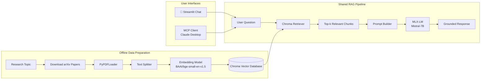

# AI_RA
AI – Research Assistant using MLX-LM Models

A fully local **Retrieval-Augmented Generation (RAG)** application for querying research papers using **MLX-LM**, **LangChain**, and **ChromaDB**.

This project demonstrates how to build a modern RAG pipeline that runs entirely on Apple Silicon. Research papers are downloaded, indexed into a vector database, semantically retrieved based on a user's question, and passed to a locally hosted Large Language Model to generate evidence-based responses.

## Features
- 📚 Download research papers directly from arXiv
- 📄 Parse and extract text from PDF documents
- ✂️ Split documents into semantically meaningful chunks.
- 🗂️ Generate and store dense vector embeddings using Chroma Vector database. 
- 🔍 Perform semantic similarity search over indexed documents. 
- 🤖 Generate responses using a locally hosted MLX language model. 
- 💬 Interactive streamlit chat interface with token streaming.
- 🔌 MCP server for Claude Desktop and other MCP-compatible clients

## Interfaces

The AI Research Assistant can be accessed through two interfaces that share the same Retrieval-Augmented Generation (RAG) pipeline.

| Interface | Description |
|-----------|-------------|
| 💬 **Streamlit** | Browser-based chat application for creating research databases and asking questions about indexed literature. |
|  **MCP Server** | Exposes the RAG pipeline as MCP tools that can be accessed from Claude Desktop and other MCP-compatible clients. |

---

## Documentation

The following guides walk through running the application and connecting an MCP client.

| Guide | Description |
|-------|-------------|
| 📘 [Running the Streamlit Application](docs/streamlit.md) | Set up the project, build research databases, and use the Streamlit interface. |
| 📘 [Connecting Claude Desktop with MCP](docs/mcp.md) | Configure Claude Desktop to connect to the AI Research Assistant through MCP. |

---

## Pipelines
The project consists of two independent workflows. 
1. **Document Indexing Pipeline:** – Downloads, processes, and indexes research papers into a vector database.
2. **RAG Question Answering Pipeline:** – Retrieves relevant document chunks and generates responses using a local MLX language model.

### Document Indexing Pipeline

This pipeline is responsible for preparing research papers for semantic retrieval.

1. Research papers are downloaded from arXiv.
2. Each PDF is parsed into individual pages.
3. Pages are divided into overlapping text chunks.
4. Each chunk is converted into a dense vector embedding.
5. The embeddings and associated metadata are stored in a persistent Chroma vector database.

This process only needs to be performed once for a given document collection. Once the vector database has been created, it can be reused for future queries without regenerating embeddings.

### RAG Question Answering Pipeline

When a user submits a question through the Streamlit interface, the application performs semantic retrieval before invoking the language model.

Rather than asking the language model to answer solely from its pretrained knowledge, the retriever first identifies the most relevant document chunks from the indexed research papers. These retrieved excerpts are combined with the user's question to construct a grounded prompt.

The resulting prompt is then supplied to the local MLX language model, which generates a response based on the retrieved context. This approach significantly reduces hallucinations while ensuring that responses remain tied to the indexed literature.

## End-to-End System Architecture

## Example Workflow

The following demo shows Claude Desktop creating a research database through the AI Research Assistant MCP server.

<video controls width="800">
  <source src="docs/visuals/mcp_create_db.mp4" type="video/mp4">
  Your browser does not support the video tag.
</video>