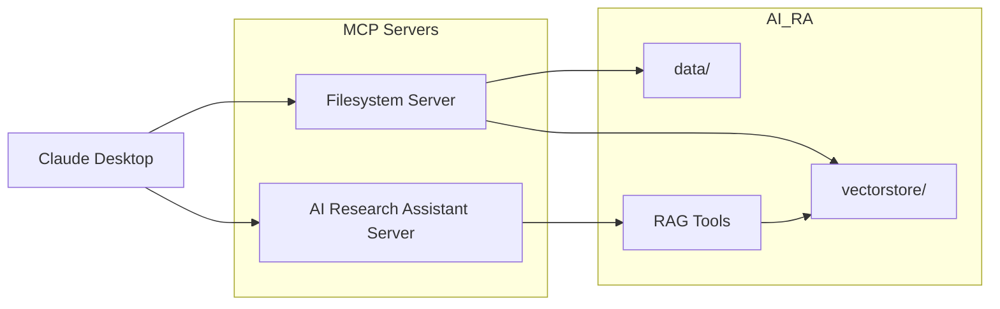

## Prerequisites

Before configuring Claude Desktop, ensure that the following are installed:

- Claude Desktop
- Conda or Anaconda
- The `AIRA` Conda environment
- Node.js and `npx` for the Filesystem MCP server

### Install Node.js and npx on macOS

The Filesystem MCP server is launched through `npx`. Check whether Node.js and `npx` are already available:

```bash
node --version
npx --version
```

If either command is unavailable, install Node.js with Homebrew:

```bash
brew install node
```

Verify the installation:

```bash
node --version
npm --version
npx --version
```

> The AI Research Assistant MCP server runs through Python. Node.js and `npx` are required only for the Filesystem MCP server.


# Connecting Claude Desktop with MCP

This guide explains how to connect **Claude Desktop** to the AI Research Assistant using the **Model Context Protocol (MCP)**.

The project exposes a local MCP server that allows Claude Desktop to:

- Create research databases from arXiv
- List available databases
- View database metadata
- Ask research questions using the shared RAG pipeline

---

## MCP Architecture



The two MCP servers provide complementary capabilities:

| Server | Purpose |
|---------|---------|
| **Filesystem** | Allows Claude Desktop to access the project's `data/` and `vectorstore/` directories. |
| **AI Research Assistant** | Exposes the RAG pipeline through MCP tools for creating databases and answering research questions. |

---

## Configure Claude Desktop

On macOS, open:

```text
~/Library/Application Support/Claude/claude_desktop_config.json
```

Add the following configuration (replace the paths with your own):

```json
{
  "mcpServers": {
    "filesystem": {
      "command": "npx",
      "args": [
        "-y",
        "@modelcontextprotocol/server-filesystem",
        "/Users/<username>/AI_RA/data",
        "/Users/<username>/AI_RA/vectorstore"
      ]
    },
    "ai-research-assistant": {
      "command": "/bin/zsh",
      "args": [
        "-lc",
        "cd /Users/<username>/AI_RA && /Users/<username>/anaconda3/envs/AIRA/bin/python -m mcp_server.server"
      ]
    }
  }
}
```

Save the file and restart Claude Desktop.

---

## Available Tools

Once connected, Claude Desktop can invoke the following tools exposed by the AI Research Assistant:

| Tool | Description |
|------|-------------|
| `list_databases` | List all available research databases. |
| `build_database` | Create a new research database from arXiv papers. |
| `database_status` | View metadata for a research database. |
| `ask_research_question` | Query a selected research database using the local RAG pipeline. |

---

## Working with Research Databases

Research databases are shared between the Streamlit application and the MCP server.

For example:

- A database created through **Streamlit** is immediately available in Claude Desktop.
- A database created through **Claude Desktop** appears in the Streamlit interface.

Both interfaces operate on the same Chroma vector databases stored in the `vectorstore/` directory.

---

## Example Workflow

Ask Claude to create a new database:

> Build a research database named **Vision Transformers** using the arXiv topic **vision transformers** and download 20 papers.

Then ask a question:

> What positional encoding methods are commonly used in Vision Transformers?

Claude will automatically invoke the appropriate MCP tools, retrieve relevant document chunks from the selected database, and generate a grounded response using the local MLX language model.